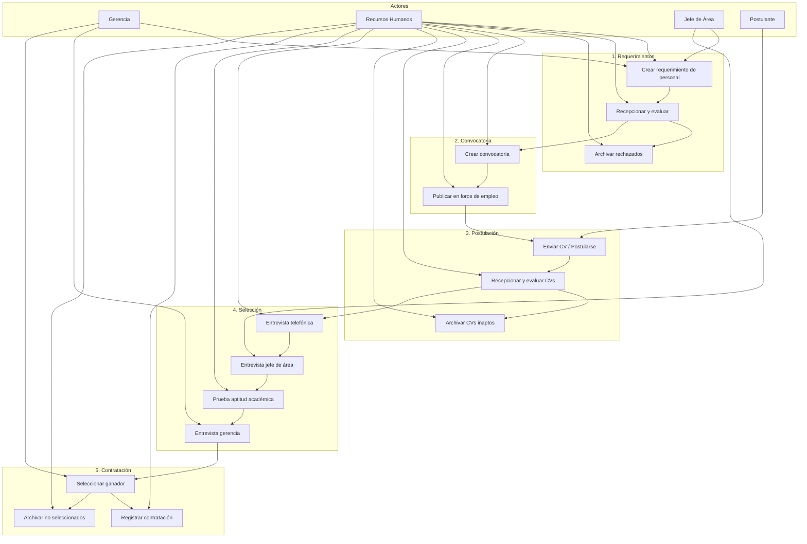
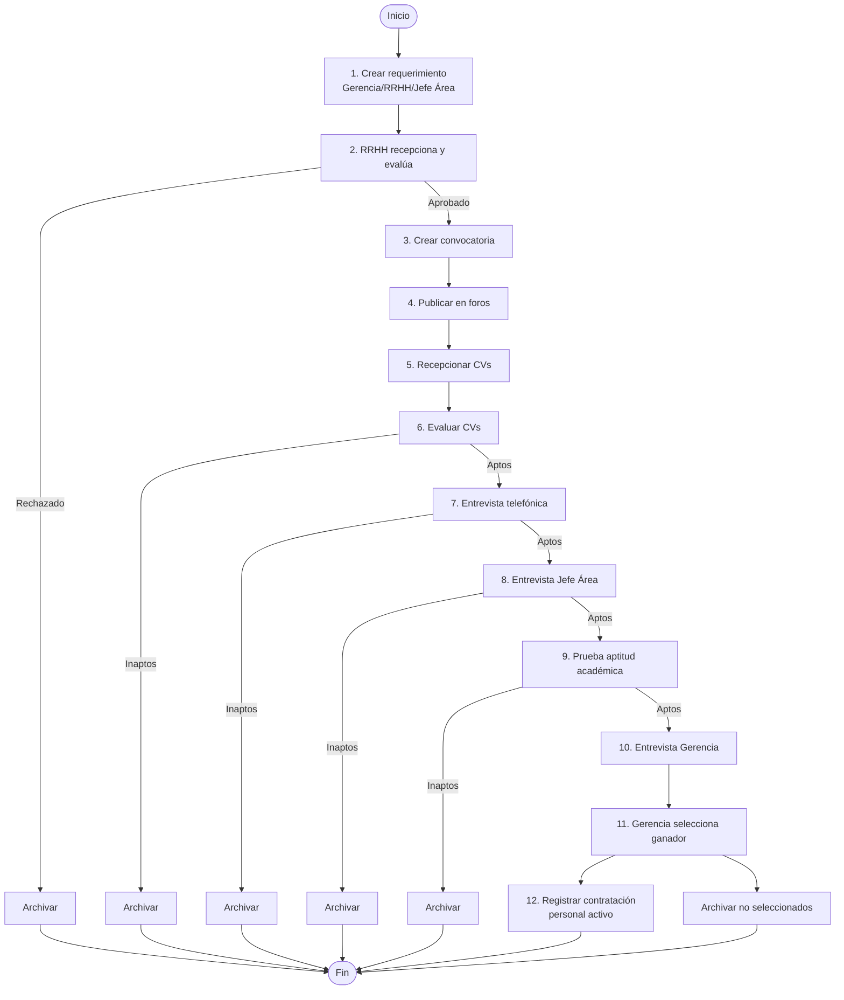

# Diagrama de Casos de Uso - Mermaid (Alternativa)

Puedes visualizar este diagrama en cualquier editor que soporte Mermaid (GitHub, GitLab, Notion, VS Code con extensión Mermaid, etc.)

## Opción 1: Diagrama compacto

## Opción 2: Flujo de proceso (secuencial)

## Matriz de actores y casos de uso

| Caso de Uso | Gerencia | RRHH | Jefe Área | Postulante |
|-------------|:--------:|:----:|:---------:|:----------:|
| Crear requerimiento | ✓ | ✓ | ✓ | |
| Recepcionar y evaluar requerimiento | | ✓ | | |
| Archivar rechazados | | ✓ | | |
| Crear convocatoria | | ✓ | | |
| Publicar convocatoria | | ✓ | | |
| Enviar CV / Postularse | | | | ✓ |
| Recepcionar y evaluar CVs | | ✓ | | |
| Archivar CVs inaptos | | ✓ | | |
| Entrevista telefónica | | ✓ | | |
| Entrevista jefe de área | | | ✓ | |
| Prueba aptitud académica | | ✓ | | |
| Entrevista gerencia | ✓ | | | |
| Seleccionar candidato ganador | ✓ | | | |
| Registrar contratación | | ✓ | | |
| Archivar no seleccionados | | ✓ | | |
