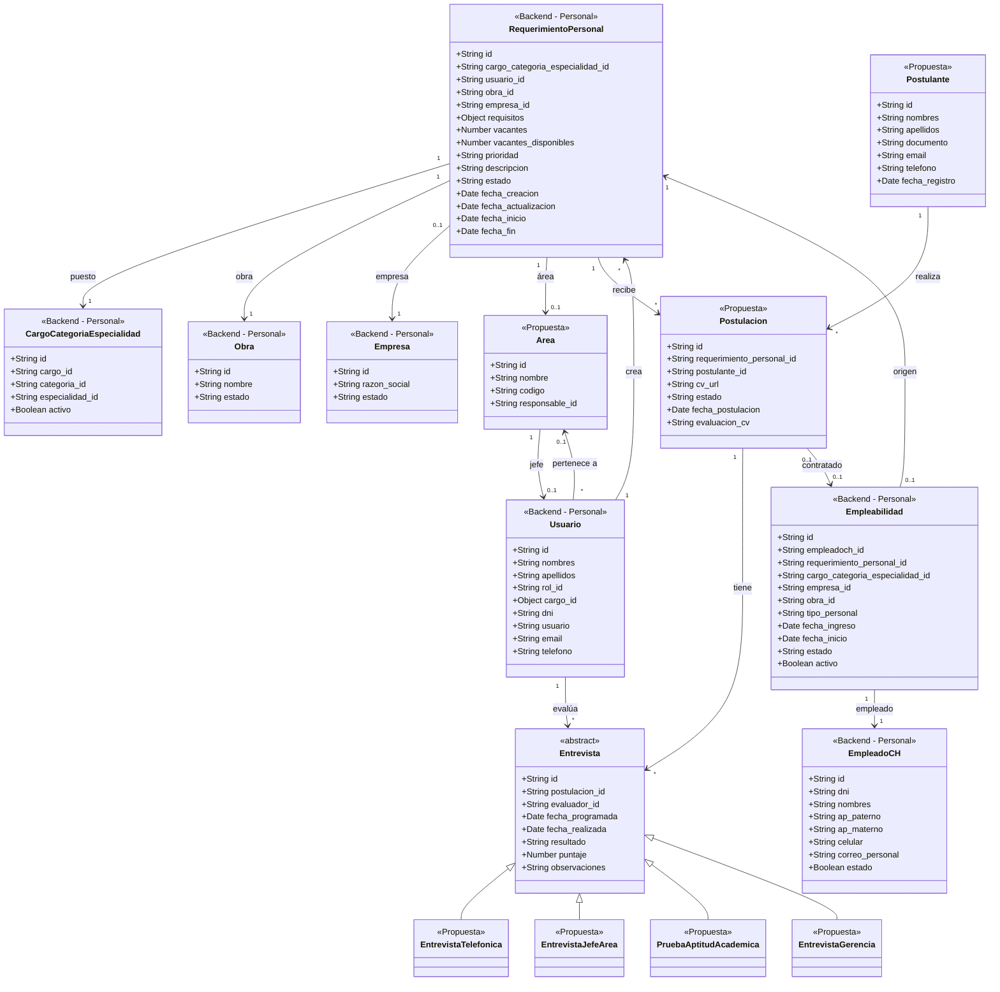
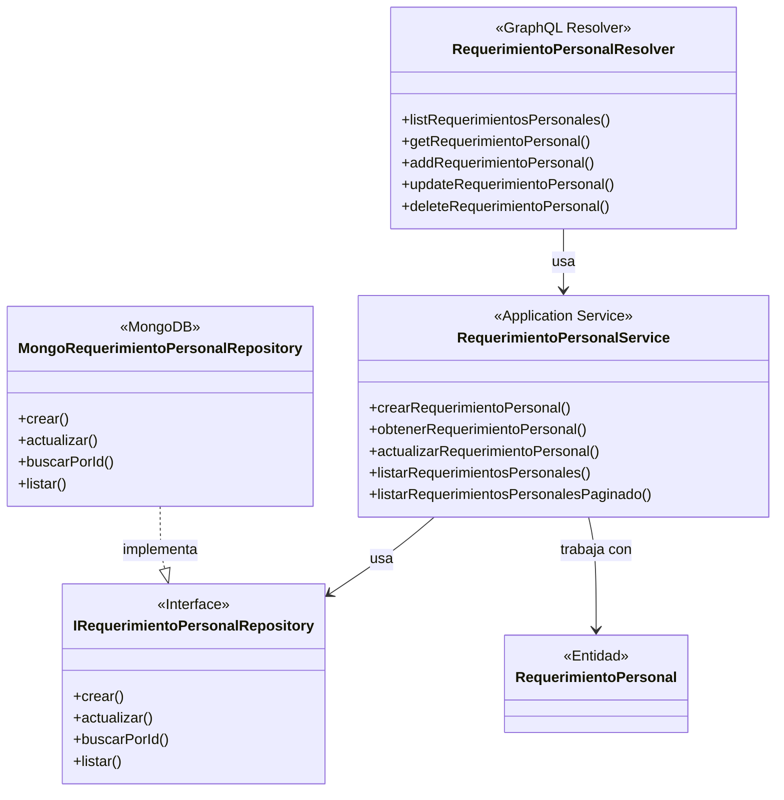
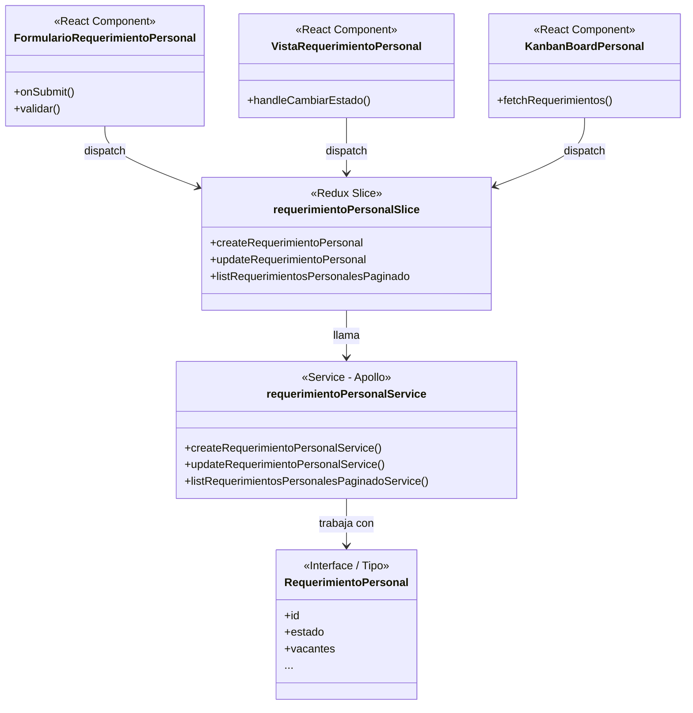
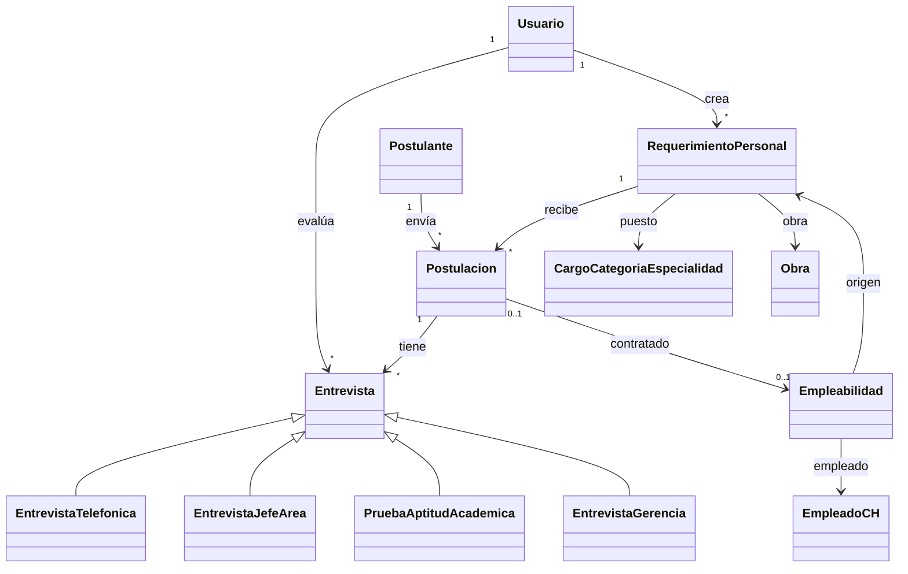

# Diagrama de Clases - Sistema de Reclutamiento de Personal

Basado en la arquitectura del proyecto: **Personal** (backend) + **Personal-frontend** (frontend), con GraphQL como API.

---

## Arquitectura del proyecto

| Capa | Proyecto | Ubicación | Contenido |
|------|----------|-----------|-----------|
| **Dominio** | Personal | `src/dominio/entidades/` | RequerimientoPersonal, Empleabilidad, EmpleadoCH, Usuario, etc. |
| **Aplicación** | Personal | `src/aplicacion/servicios/` | RequerimientoPersonalService, EmpleabilidadService, EmpleadoCHService, etc. |
| **Infraestructura** | Personal | `src/infraestructura/` | GraphQL resolvers, repositorios MongoDB |
| **UI + Estado** | Personal-frontend | `src/slices/`, `src/pages/` | requerimientoPersonalSlice, empleabilidadSlice, formularios, Kanban |
| **API Client** | Personal-frontend | `src/services/` | requerimientoPersonalService (GraphQL), apolloClient |

---

## Decisiones de diseño

| Tema | Decisión |
|------|----------|
| **Convocatoria** | Solo un **estado** del RequerimientoPersonal (backend: `estado = "Convocatoria"`), no es clase separada |
| **Entrevistas** | **Subclases**: EntrevistaTelefonica, EntrevistaJefeArea, PruebaAptitudAcademica, EntrevistaGerencia |
| **Evaluación entrevistas** | Guardar **ambos**: puntaje numérico y resultado Apto/Inapto |
| **CV** | Solo URL (archivo), sin datos estructurados |
| **Estados RequerimientoPersonal** | Aprobado, Desaprobado, En espera, Archivado |
| **Empleabilidad** | Se crea **manualmente** cuando RR.HH. registra la contratación (no automático) |
| **Postulante** | **Entidad nueva** (personas nuevas); no se reutiliza EmpleadoCH |
| **Estados Postulacion** | Pendiente, Apto, Inapto, En entrevista, Archivado, Seleccionado, Contratado |
| **Área** | **Propuesta**: Usuario pertenece a Área; Jefe de Área = Usuario responsable del Área |

---

## Diagrama 1: Entidades del dominio (Backend + Propuestas)

---

## Diagrama 2: Capas Backend (Personal)

---

## Diagrama 3: Capas Frontend (Personal-frontend)

---

## Diagrama 4: Modelo simplificado (relaciones principales)

---

## Estados de RequerimientoPersonal

| Estado | Descripción |
|--------|-------------|
| **En espera** | Requerimiento creado; pendiente de evaluación por RR.HH. |
| **Aprobado** | RR.HH. aprobó; puede publicarse y recibir postulaciones |
| **Desaprobado** | Rechazado por RR.HH. durante la evaluación |
| **Archivado** | Archivado (ej. proceso finalizado o cerrado) |

*Nota: En el backend actual también se usan "Solicitud personal", "Aprobacion de Gerencia", "Convocatoria".*

---

## Estados de Postulacion (propuesta)

| Estado | Descripción |
|--------|-------------|
| **Pendiente** | CV recibido, pendiente de evaluación |
| **Apto** | Aprobado en evaluación de CV |
| **Inapto** | No cumple requisitos en CV |
| **En entrevista** | En proceso de entrevistas |
| **Archivado** | Rechazado en alguna etapa; archivado |
| **Seleccionado** | Ganador elegido por Gerencia |
| **Contratado** | Empleabilidad creada; ya es personal activo |

---

## Resumen: Backend (Personal) vs Propuestas

| Clase | Ubicación | Estado |
|-------|-----------|--------|
| **RequerimientoPersonal** | Personal/dominio/entidades | Existe |
| **Usuario** | Personal/dominio/entidades | Existe |
| **CargoCategoriaEspecialidad** | Personal/dominio/entidades | Existe |
| **Obra** | Personal/dominio/entidades | Existe |
| **Empresa** | Personal/dominio/entidades | Existe |
| **EmpleadoCH** | Personal/dominio/entidades | Existe |
| **Empleabilidad** | Personal/dominio/entidades | Existe |
| **RequerimientoPersonalService** | Personal/aplicacion/servicios | Existe |
| **RequerimientoPersonalResolver** | Personal/infraestructura/graphql | Existe |
| **requerimientoPersonalSlice** | Personal-frontend/slices | Existe |
| **requerimientoPersonalService** | Personal-frontend/services | Existe |
| **Area** | — | Propuesta |
| **Postulante** | — | Propuesta |
| **Postulacion** | — | Propuesta |
| **Entrevista** (y subclases) | — | Propuesta |
