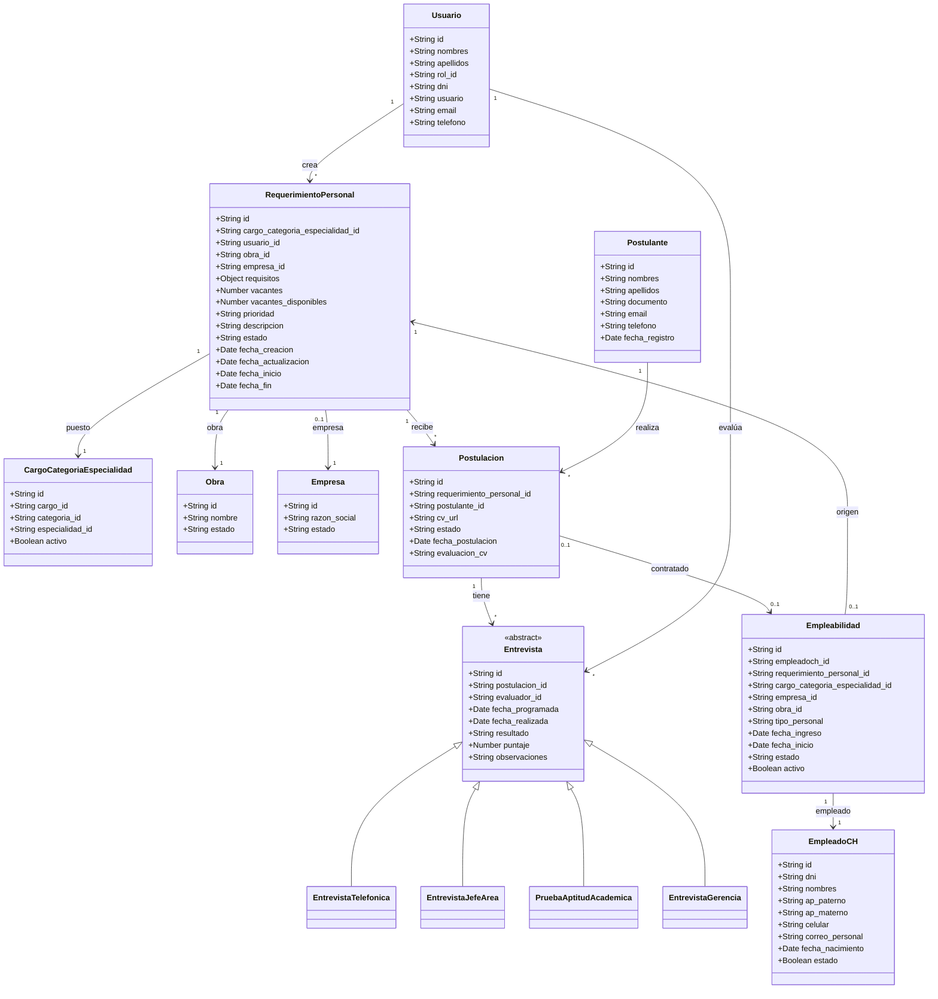
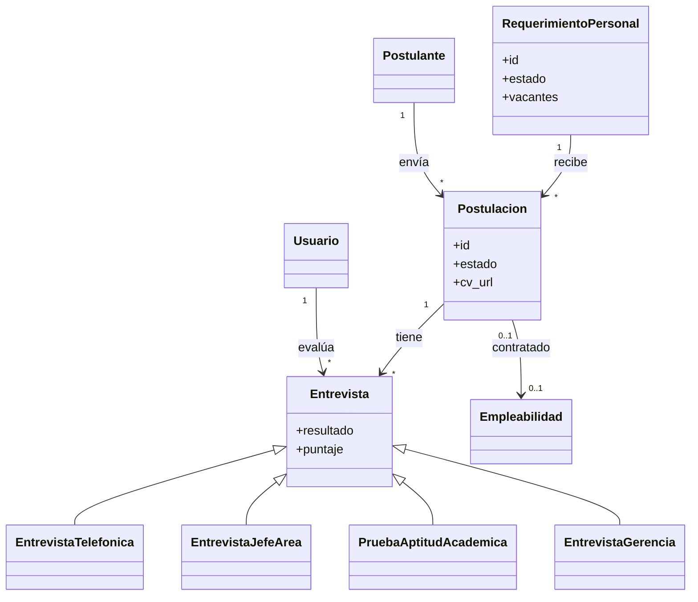

# Diagrama de Clases - Sistema de Reclutamiento de Personal

Basado en el diagrama de casos de uso, las entidades del backend y las decisiones de diseño acordadas.

---

## Decisiones de diseño

| Tema | Decisión |
|------|----------|
| **Convocatoria** | Solo un **estado** del RequerimientoPersonal (backend: `estado = "Convocatoria"`), no es clase separada |
| **Entrevistas** | **Subclases**: EntrevistaTelefonica, EntrevistaJefeArea, PruebaAptitudAcademica, EntrevistaGerencia |
| **Evaluación entrevistas** | Guardar **ambos**: puntaje numérico y resultado Apto/Inapto |
| **CV** | Solo URL (archivo), sin datos estructurados |
| **Estados RequerimientoPersonal** | Solicitud personal → Aprobación de Gerencia → Convocatoria (y Rechazado, Cancelado, Suspendido) |
| **Empleabilidad** | Se crea **manualmente** cuando RR.HH. registra la contratación (no automático) |

---

## Diagrama de clases completo (Mermaid)

---

## Diagrama simplificado

---

## Estados de RequerimientoPersonal

| Estado | Descripción |
|--------|-------------|
| **Solicitud personal** | Requerimiento creado, pendiente de evaluación |
| **Aprobacion de Gerencia** | En revisión por gerencia |
| **Convocatoria** | Aprobado y publicado; recibe postulaciones |
| **Solicitud personal Rechazado** | Rechazado, archivado |
| **Cancelado** | Cancelado |
| **Suspendido** | Suspendido temporalmente |

---

## Clases del diagrama

| Clase | Estado | Descripción |
|-------|--------|-------------|
| **RequerimientoPersonal** | Existe en backend | Solicitud de personal. Estados: Solicitud personal → Aprobación → Convocatoria |
| **Usuario** | Existe en backend | Actores: Gerencia, RR.HH., Jefe de Área |
| **CargoCategoriaEspecialidad** | Existe en backend | Puesto/cargo solicitado |
| **Obra** | Existe en backend | Proyecto u obra asociada |
| **EmpleadoCH** | Existe en backend | Persona en base de datos |
| **Empleabilidad** | Existe en backend | Alta como personal activo (contratación manual) |
| **Postulante** | Propuesta | Persona que envía CV |
| **Postulacion** | Propuesta | Postulación a un requerimiento en estado Convocatoria. CV = `cv_url` |
| **Entrevista** | Propuesta (abstracta) | Base para las 4 etapas de evaluación |
| **EntrevistaTelefonica** | Propuesta | Evaluación telefónica (RR.HH.) |
| **EntrevistaJefeArea** | Propuesta | Entrevista con jefe de área |
| **PruebaAptitudAcademica** | Propuesta | Prueba de aptitud (Jefe de Área) |
| **EntrevistaGerencia** | Propuesta | Entrevista con gerencia (decisión final) |

---

## Preguntas pendientes

- **Postulante vs EmpleadoCH**: ¿El Postulante es entidad nueva o se reutiliza EmpleadoCH?
- **Estados de Postulacion**: ¿Pendiente, Apto, Inapto, Archivado, Seleccionado?
- **Área / Jefe de Área**: ¿Existe entidad Área o solo Usuario?
