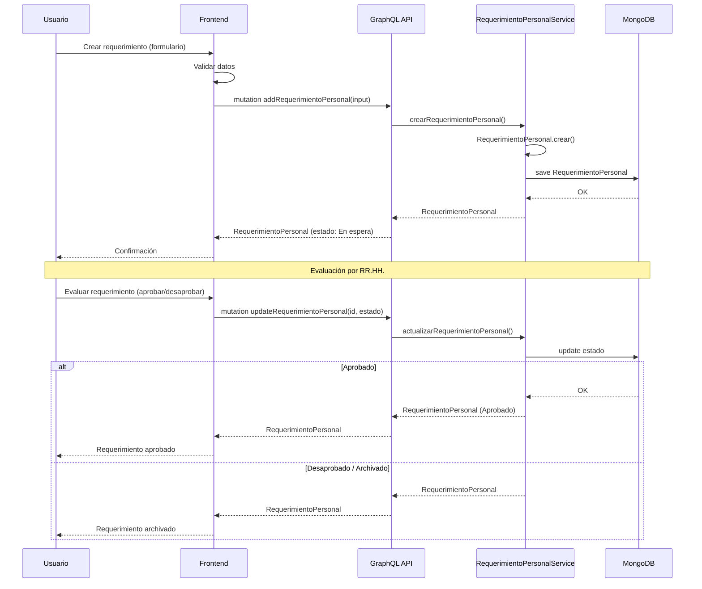
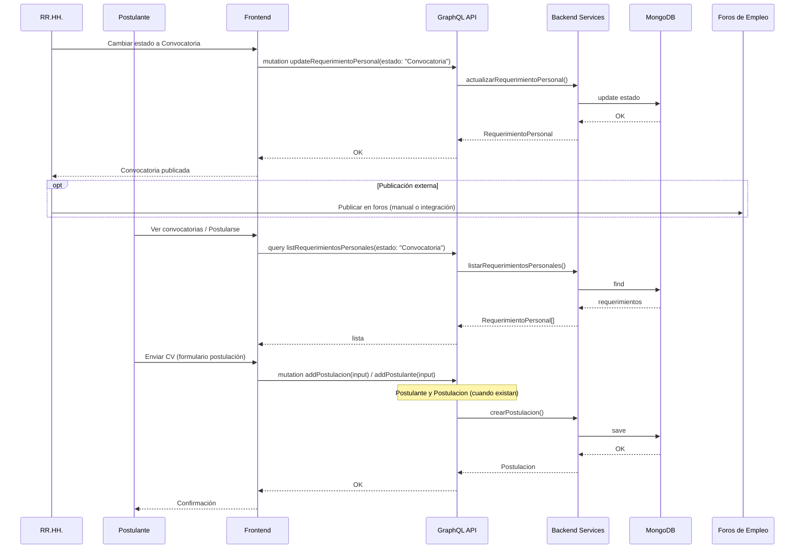
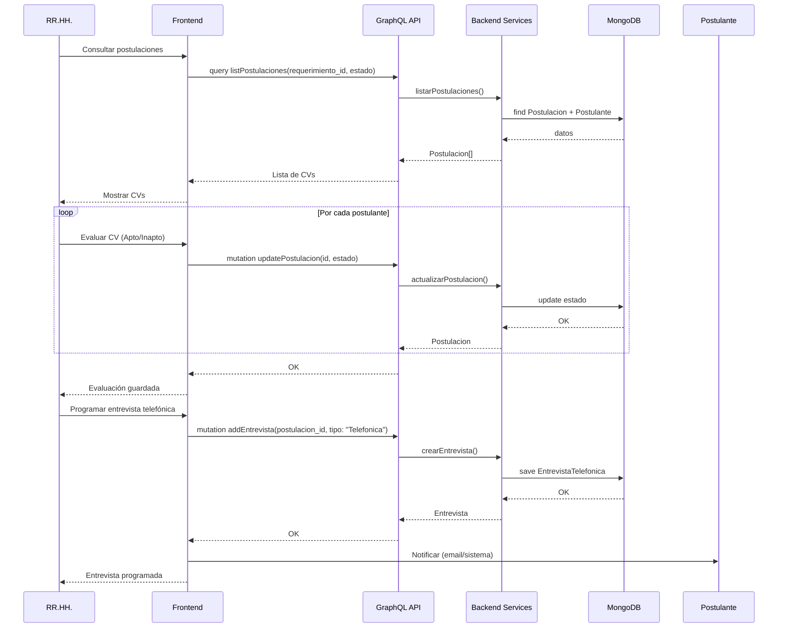
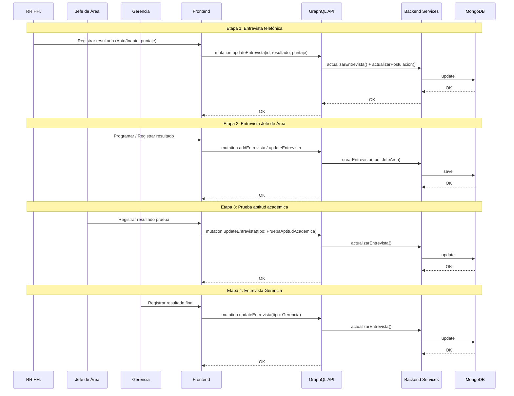
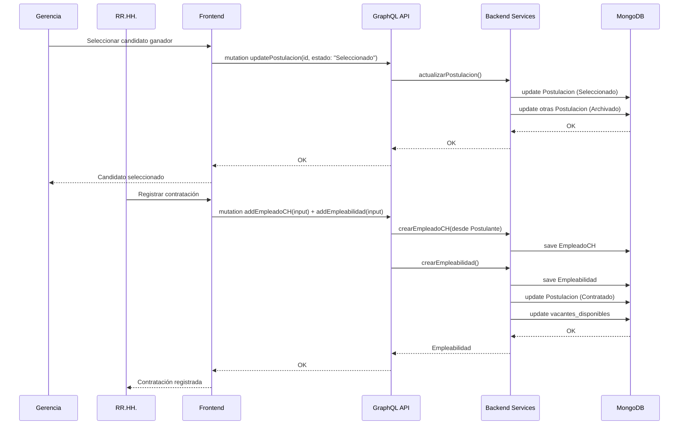
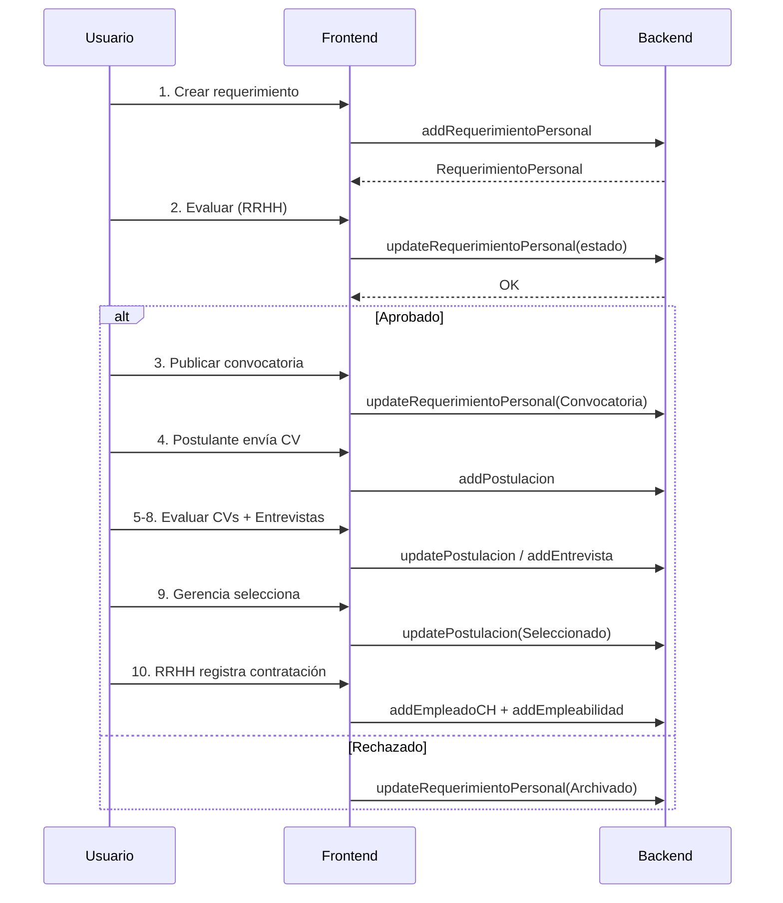

# Diagrama de Secuencias - Sistema de Reclutamiento de Personal

Basado en el flujo del proceso, la arquitectura del proyecto (**Personal-frontend** + **Personal**) y la comunicación vía **GraphQL**.

---

## Arquitectura del sistema

| Capa | Proyecto | Tecnología |
|------|----------|------------|
| **Frontend** | Personal-frontend | React, Redux, Apollo Client |
| **Backend API** | Personal | GraphQL (resolvers) |
| **Lógica de negocio** | Personal | Servicios de aplicación |
| **Persistencia** | Personal | MongoDB (repositorios) |

---

## 1. Crear y evaluar requerimiento

---

## 2. Publicar convocatoria y postulación

---

## 3. Evaluar CVs y programar entrevista telefónica

---

## 4. Proceso de entrevistas

---

## 5. Selección y contratación

---

## 6. Flujo completo (visión sistema)

---

## Resumen de diagramas

| # | Diagrama | Participantes | Descripción |
|---|----------|---------------|-------------|
| 1 | Crear y evaluar requerimiento | Usuario, Frontend, GraphQL API, Service, MongoDB | Flujo completo con capas Frontend ↔ Backend ↔ DB |
| 2 | Publicar convocatoria y postulación | RRHH, Postulante, Frontend, API, Services, DB, Foros | Publicación y recepción de postulaciones |
| 3 | Evaluar CVs | RRHH, Frontend, API, Services, DB, Postulante | Evaluación de CVs y programación de entrevista telefónica |
| 4 | Proceso de entrevistas | RRHH, Jefe Área, Gerencia, Frontend, API, Services, DB | Las 4 etapas con interacción Frontend-Backend |
| 5 | Selección y contratación | Gerencia, RRHH, Frontend, API, Services, DB | Selección y registro de contratación |
| 6 | Flujo completo | Usuario, Frontend, Backend | Visión resumida del flujo |

---

## Notas técnicas

- **Frontend**: Redux (slices) despacha acciones que llaman a los servicios (Apollo Client).
- **GraphQL**: Queries para leer, Mutations para crear/actualizar/eliminar.
- **Backend**: Resolvers → Servicios de aplicación → Repositorios → MongoDB.
- **Entidades Postulante, Postulacion, Entrevista**: Diagramas asumen que existirán en el backend; actualmente el proyecto tiene RequerimientoPersonal, Empleabilidad, EmpleadoCH.
