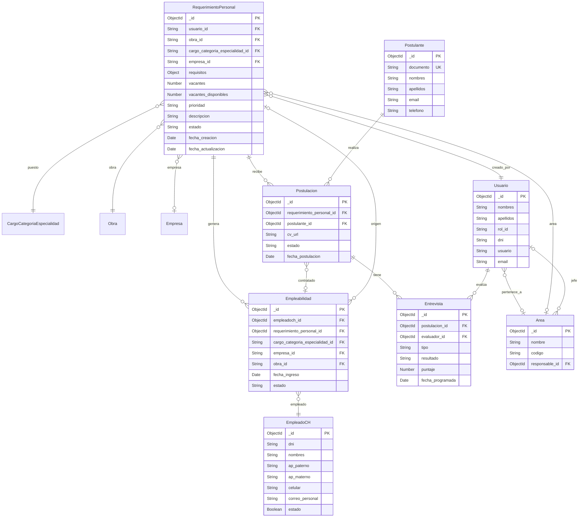

# Modelo Entidad-Relación - Sistema de Reclutamiento de Personal

**Base de datos:** MongoDB  
**Proyecto:** Personal (backend) + Personal-frontend

---

## Diagrama ER (Mermaid erDiagram)



---

## Colecciones MongoDB

### Existentes (Personal)

| Colección | Descripción |
|-----------|-------------|
| **requerimientospersonales** | Solicitudes de personal |
| **empleabilidades** | Altas de personal activo |
| **empleadosch** | Personas en base de datos |
| **cargoscategoriaespecialidad** | Relación cargo-categoría-especialidad |
| **obras** | Proyectos/obras |
| **empresas** | Empresas |
| **usuarios** | Usuarios del sistema (puede estar en servicio externo) |

### Propuestas

| Colección | Descripción |
|-----------|-------------|
| **areas** | Áreas organizacionales |
| **postulantes** | Personas que postulan |
| **postulaciones** | CV/postulaciones a requerimientos |
| **entrevistas** | Evaluaciones (telefónica, jefe área, prueba, gerencia) |

---

## Detalle de entidades

### RequerimientoPersonal

| Campo | Tipo | Requerido | Descripción |
|-------|------|-----------|-------------|
| _id | ObjectId | Sí | PK |
| usuario_id | String | Sí | FK Usuario (creador) |
| obra_id | String | Sí | FK Obra |
| cargo_categoria_especialidad_id | String | Sí | FK CargoCategoriaEspecialidad |
| empresa_id | String | No | FK Empresa |
| area_id | String | No | FK Area (propuesta) |
| requisitos | Object | Sí | Requisitos del puesto |
| vacantes | Number | Sí | |
| vacantes_disponibles | Number | Sí | |
| prioridad | String | Sí | alta, media, baja |
| descripcion | String | Sí | |
| estado | String | Sí | En espera, Aprobado, Desaprobado, Archivado |
| fecha_creacion | Date | Sí | |
| fecha_actualizacion | Date | Sí | |

### Empleabilidad

| Campo | Tipo | Requerido | Descripción |
|-------|------|-----------|-------------|
| _id | ObjectId | Sí | PK |
| empleadoch_id | ObjectId | Sí | FK EmpleadoCH |
| requerimiento_personal_id | ObjectId | No | FK RequerimientoPersonal |
| cargo_categoria_especialidad_id | String | Sí | FK |
| empresa_id | String | Sí | FK |
| obra_id | String | No | FK |
| tipo_personal | String | Sí | Directo, Proveedor, Subcontrata, Visitante |
| fecha_ingreso | Date | Sí | |
| estado | String | Sí | Activo, Traslado, Baja |

### Postulacion (propuesta)

| Campo | Tipo | Requerido | Descripción |
|-------|------|-----------|-------------|
| _id | ObjectId | Sí | PK |
| requerimiento_personal_id | ObjectId | Sí | FK |
| postulante_id | ObjectId | Sí | FK |
| cv_url | String | Sí | URL del CV |
| estado | String | Sí | Pendiente, Apto, Inapto, En entrevista, Archivado, Seleccionado, Contratado |
| fecha_postulacion | Date | Sí | |
| evaluacion_cv | String | No | Notas de RRHH |

### Entrevista (propuesta)

| Campo | Tipo | Requerido | Descripción |
|-------|------|-----------|-------------|
| _id | ObjectId | Sí | PK |
| postulacion_id | ObjectId | Sí | FK |
| evaluador_id | ObjectId | Sí | FK Usuario |
| tipo | String | Sí | Telefonica, JefeArea, PruebaAptitud, Gerencia |
| resultado | String | Sí | Apto, Inapto |
| puntaje | Number | No | |
| fecha_programada | Date | No | |
| fecha_realizada | Date | No | |
| observaciones | String | No | |

---

## Referencias en MongoDB

En MongoDB las relaciones se implementan con **referencias** (ObjectId):

```
RequerimientoPersonal.usuario_id    → Usuario._id
RequerimientoPersonal.obra_id       → Obra._id
RequerimientoPersonal.cargo_categoria_especialidad_id → CargoCategoriaEspecialidad._id
Empleabilidad.empleadoch_id         → EmpleadoCH._id
Empleabilidad.requerimiento_personal_id → RequerimientoPersonal._id
Postulacion.requerimiento_personal_id   → RequerimientoPersonal._id
Postulacion.postulante_id           → Postulante._id
Entrevista.postulacion_id           → Postulacion._id
Entrevista.evaluador_id             → Usuario._id
```

---

## Índices sugeridos

```javascript
// RequerimientoPersonal
db.requerimientospersonales.createIndex({ estado: 1 })
db.requerimientospersonales.createIndex({ usuario_id: 1 })
db.requerimientospersonales.createIndex({ obra_id: 1, estado: 1 })

// Postulacion (propuesta)
db.postulaciones.createIndex({ requerimiento_personal_id: 1, estado: 1 })
db.postulaciones.createIndex({ postulante_id: 1 })

// Postulante (propuesta) - documento único para búsqueda
db.postulantes.createIndex({ documento: 1 }, { unique: true })

// Entrevista (propuesta)
db.entrevistas.createIndex({ postulacion_id: 1 })
db.entrevistas.createIndex({ postulacion_id: 1, tipo: 1 })
```

---

## Notas MongoDB

1. **ObjectId**: MongoDB usa `_id` como ObjectId por defecto.
2. **Referencias**: Las FK se guardan como `String` u `ObjectId` según el esquema Mongoose.
3. **Embedded vs Referenced**: Para 1:N donde el hijo siempre se consulta con el padre, se puede usar subdocumentos (ej. Entrevistas embebidas en Postulacion). Para consultas independientes, usar colección separada con referencia.
4. **Estados RequerimientoPersonal**: En backend actual: "Solicitud personal", "Aprobacion de Gerencia", "Convocatoria", "Solicitud personal Rechazado", etc. El modelo conceptual usa: En espera, Aprobado, Desaprobado, Archivado.
