# Diagrama de Casos de Uso - MS. Condiciones, Anticipos y Descuentos

## Sistema: Módulo Condiciones, Anticipos y Descuentos

```mermaid
flowchart TB
    subgraph Sistema["🏢 SISTEMA: Condiciones, Anticipos y Descuentos"]
        subgraph Mod1["MÓDULO 1 - Condiciones y Subsidios"]
            UC01([Configurar plantillas de condiciones])
            UC02([Crear / Editar / Eliminar configuración])
            UC03([Activar o desactivar configuración])
            UC04([Asignar condición a trabajador])
            UC05([Asignar alimentación, movilidad o vivienda])
            UC06([Consultar condiciones asignadas activas])
            UC07([Ver detalle de condición])
            UC08([Cambiar vista monto mensual/semanal/diario])
            UC09([Consultar solicitudes pendientes o rechazadas])
            UC10([Filtrar solicitudes por estado])
            UC11([Calcular subsidios mensuales])
            UC12([Registrar pago de subsidios])
            UC13([Consultar historial de subsidios])
        end
        
        subgraph Mod2["MÓDULO 2 - Operaciones"]
            UC14([Configurar operaciones])
            UC15([Registrar préstamo])
            UC16([Registrar adelanto])
            UC17([Registrar descuento])
            UC18([Simular operación antes de registrar])
            UC19([Consultar operaciones activas])
            UC20([Ver detalle de operación])
            UC21([Consultar operaciones pendientes o rechazadas])
            UC22([Calcular descuentos mensuales])
            UC23([Registrar descuentos aplicados])
            UC24([Consultar historial de descuentos])
        end
        
        subgraph Mod3["Sistema de Aprobaciones - Kanban"]
            UC25([Revisar solicitudes en Kanban])
            UC26([Aprobar condición])
            UC27([Rechazar condición])
            UC28([Aprobar operación])
            UC29([Rechazar operación])
            UC30([Ver detalle de solicitud])
            UC31([Mover solicitud entre columnas])
            UC32([Ingresar motivo de rechazo])
            UC33([Filtrar solicitudes en Kanban])
        end
        
        subgraph Mod4["General y Reportes"]
            UC34([Consultar Dashboard])
            UC35([Consultar trabajadores])
            UC36([Generar reportes])
            UC37([Registrar pagos])
            UC38([Consultar historial de pagos])
        end
    end

    RRHH(("👤 RRHH<br/>Registra y evalúa condiciones, operaciones,<br/>realiza cálculos y reportes"))

    %% Asociaciones RRHH
    RRHH --> UC01
    RRHH --> UC04
    RRHH --> UC06
    RRHH --> UC09
    RRHH --> UC11
    RRHH --> UC12
    RRHH --> UC13
    RRHH --> UC14
    RRHH --> UC15
    RRHH --> UC16
    RRHH --> UC17
    RRHH --> UC19
    RRHH --> UC21
    RRHH --> UC22
    RRHH --> UC23
    RRHH --> UC24
    RRHH --> UC25
    RRHH --> UC34
    RRHH --> UC35
    RRHH --> UC36
    RRHH --> UC37
    RRHH --> UC38
    RRHH --> UC26
    RRHH --> UC27
    RRHH --> UC28
    RRHH --> UC29
    RRHH --> UC30
    RRHH --> UC33

    %% INCLUDE: caso base incluye al otro
    UC01 -->|include| UC02
    UC04 -->|include| UC05
    UC06 -->|include| UC07
    UC09 -->|include| UC10
    UC11 -->|include| UC12
    UC15 -->|include| UC18
    UC16 -->|include| UC18
    UC17 -->|include| UC18
    UC19 -->|include| UC20
    UC21 -->|include| UC20
    UC22 -->|include| UC23
    UC25 -->|include| UC30
    UC25 -->|include| UC33
    UC26 -->|include| UC31
    UC27 -->|include| UC32
    UC28 -->|include| UC31
    UC29 -->|include| UC32

    %% EXTEND: caso opcional extiende al base
    UC26 -.->|extend| UC25
    UC27 -.->|extend| UC25
    UC28 -.->|extend| UC25
    UC29 -.->|extend| UC25
    UC18 -.->|extend| UC15
    UC18 -.->|extend| UC16
    UC18 -.->|extend| UC17
    UC08 -.->|extend| UC06
    UC03 -.->|extend| UC01
```

## Leyenda

| Relación | Descripción |
|----------|-------------|
| **include** | El caso base siempre ejecuta el caso incluido (flujo obligatorio) |
| **extend** | El caso extendido es opcional y se ejecuta bajo cierta condición |

## Actores

- **RRHH**: Registra y evalúa condiciones, operaciones, realiza cálculos y reportes
