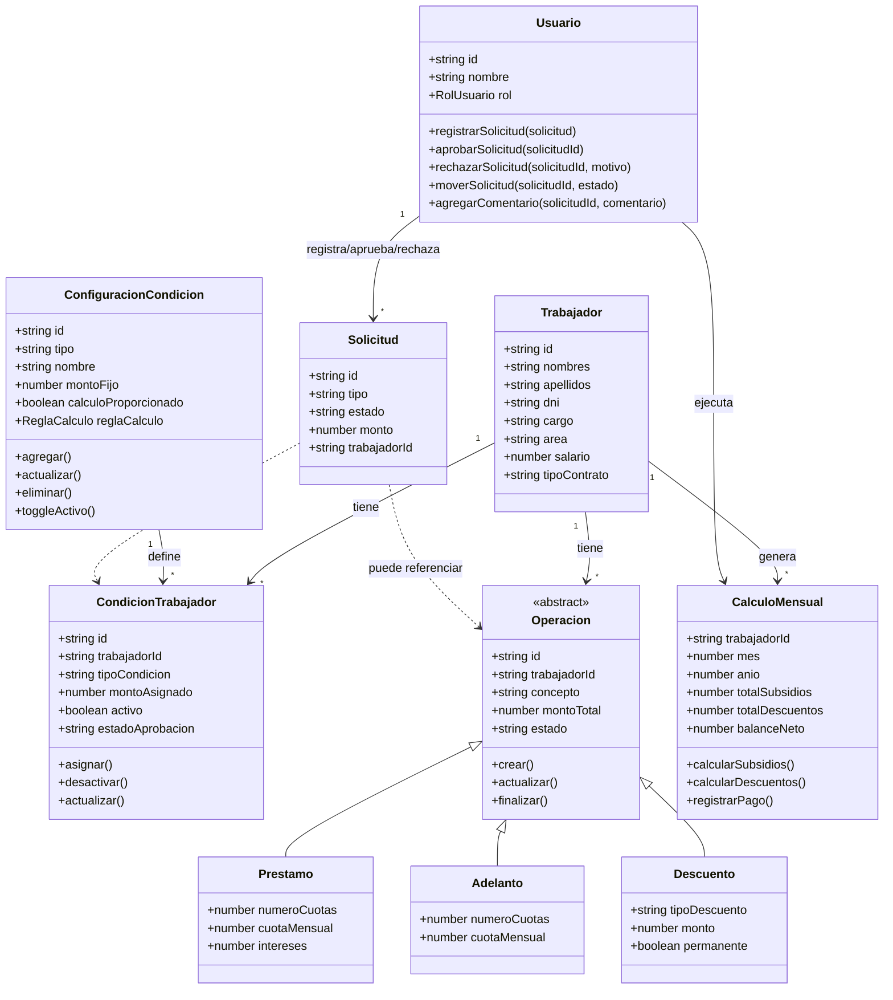

# Diagrama de Clases - MS. Condiciones, Anticipos y Descuentos

## Modelo de datos con lógica de negocio (resumido)

```mermaid
classDiagram
    class Usuario {
        +string id
        +string nombre
        +RolUsuario rol
        +registrarSolicitud(solicitud)
        +aprobarSolicitud(solicitudId)
        +rechazarSolicitud(solicitudId, motivo)
        +moverSolicitud(solicitudId, estado)
        +agregarComentario(solicitudId, comentario)
    }

    class Trabajador {
        +string id
        +string nombres
        +string apellidos
        +string dni
        +string cargo
        +string area
        +number salario
        +string tipoContrato
    }

    class ConfiguracionCondicion {
        +string id
        +string tipo
        +string nombre
        +number montoFijo
        +boolean calculoProporcionado
        +ReglaCalculo reglaCalculo
        +agregar()
        +actualizar()
        +eliminar()
        +toggleActivo()
    }

    class CondicionTrabajador {
        +string id
        +string trabajadorId
        +string tipoCondicion
        +number montoAsignado
        +boolean activo
        +string estadoAprobacion
        +asignar()
        +desactivar()
        +actualizar()
    }

    class Operacion {
        <<abstract>>
        +string id
        +string trabajadorId
        +string concepto
        +number montoTotal
        +string estado
        +crear()
        +actualizar()
        +finalizar()
    }

    class Prestamo {
        +number numeroCuotas
        +number cuotaMensual
        +number intereses
    }

    class Adelanto {
        +number numeroCuotas
        +number cuotaMensual
    }

    class Descuento {
        +string tipoDescuento
        +number monto
        +boolean permanente
    }

    class Solicitud {
        +string id
        +string tipo
        +string estado
        +number monto
        +string trabajadorId
    }

    class CalculoMensual {
        +string trabajadorId
        +number mes
        +number anio
        +number totalSubsidios
        +number totalDescuentos
        +number balanceNeto
        +calcularSubsidios()
        +calcularDescuentos()
        +registrarPago()
    }

    Usuario "1" --> "*" Solicitud : registra/aprueba/rechaza
    Trabajador "1" --> "*" CondicionTrabajador : tiene
    Trabajador "1" --> "*" Operacion : tiene
    ConfiguracionCondicion "1" --> "*" CondicionTrabajador : define
    Operacion <|-- Prestamo
    Operacion <|-- Adelanto
    Operacion <|-- Descuento
    Solicitud ..> CondicionTrabajador : puede referenciar
    Solicitud ..> Operacion : puede referenciar
    Trabajador "1" --> "*" CalculoMensual : genera
    Usuario --> CalculoMensual : ejecuta
```
