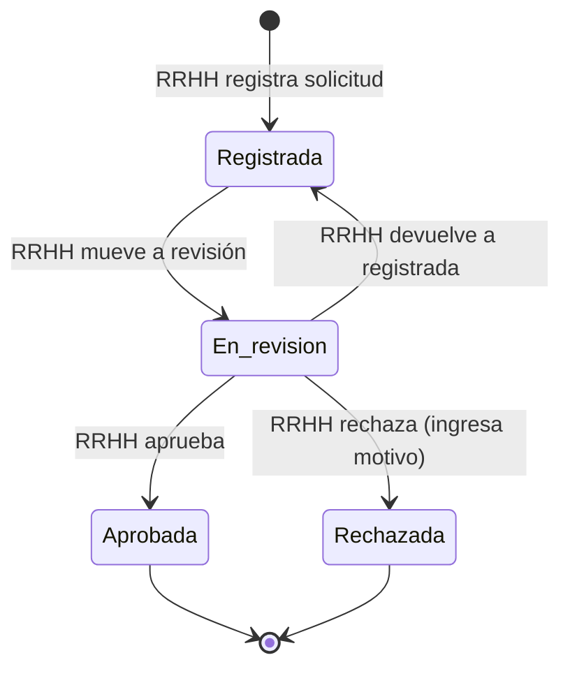
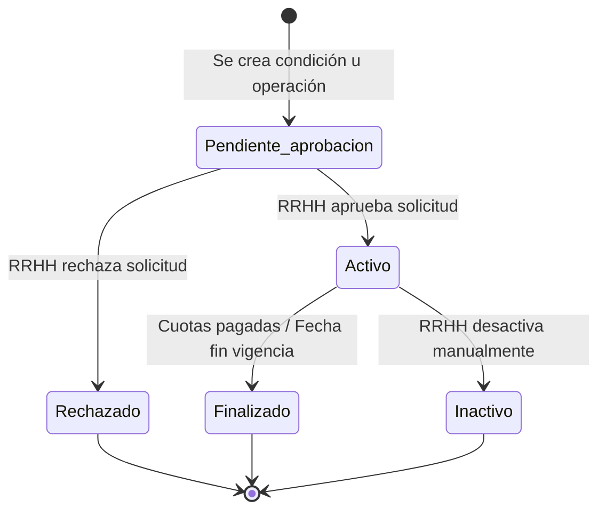
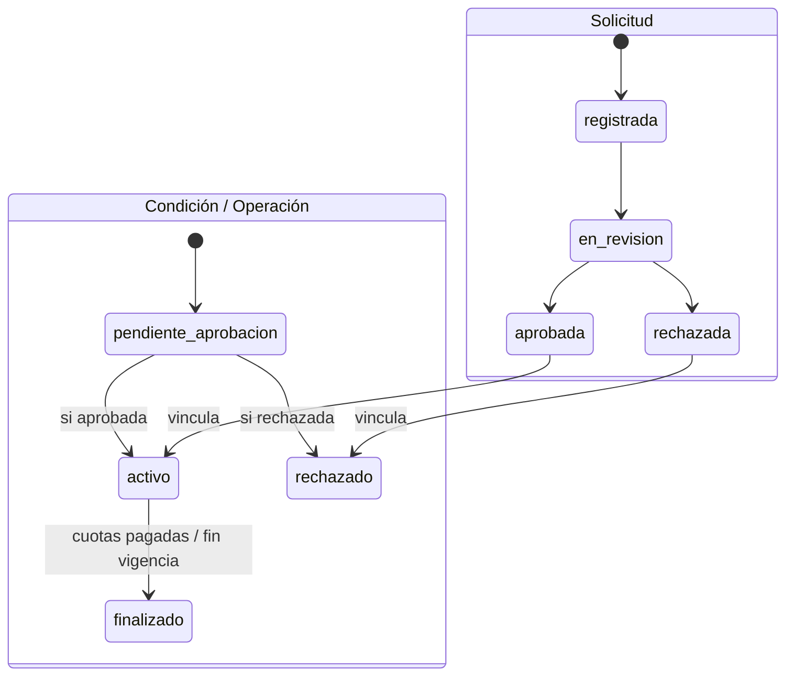

# Diagrama de Estados - MS. Condiciones, Anticipos y Descuentos

Ciclo de vida de las entidades principales del sistema en formato Mermaid (compatible con GitHub).

---

## 1. Ciclo de vida de la Solicitud

Las solicitudes (condiciones, préstamos, adelantos, descuentos) atraviesan un flujo de aprobación gestionado en el Kanban.

| Estado       | Descripción                                                      |
|-------------|------------------------------------------------------------------|
| **Registrada**   | Solicitud creada, esperando ser tomada en revisión                |
| **En_revision**  | RRHH está evaluando la solicitud en el Kanban                     |
| **Aprobada**     | Solicitud aprobada; la condición/operación se activa             |
| **Rechazada**    | Solicitud rechazada; se registra motivo, no procede              |

---

## 2. Ciclo de vida de Condición / Operación

Condiciones asignadas a trabajadores y operaciones (préstamos, adelantos, descuentos) comparten este ciclo de vida.

| Estado                   | Descripción                                                      |
|--------------------------|------------------------------------------------------------------|
| **Pendiente_aprobacion** | Creada pero requiere aprobación en Kanban                        |
| **Activo**               | Aprobada y vigente; genera subsidios o descuentos                |
| **Rechazado**            | No aprobada; no tiene efecto en cálculos                         |
| **Finalizado**           | Concluida por fin de cuotas o vigencia                           |
| **Inactivo**             | Desactivada manualmente antes del fin natural                    |

---

## 3. Vista consolidada (Solicitud y Condición/Operación)

Relación entre el estado de la solicitud y el estado de la condición u operación asociada.

