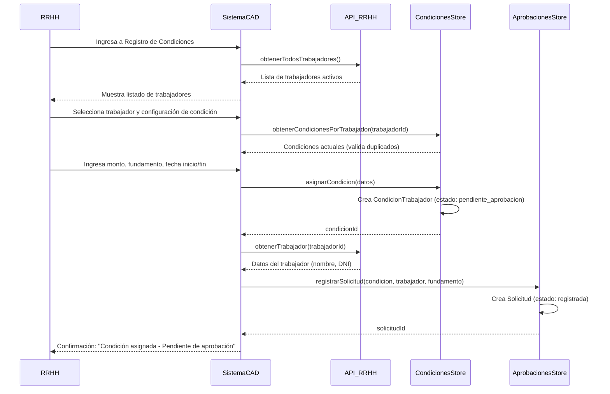
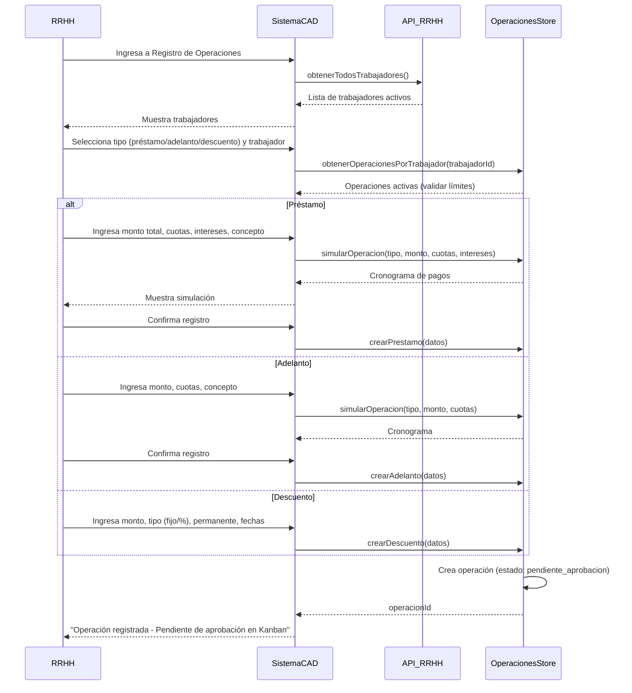
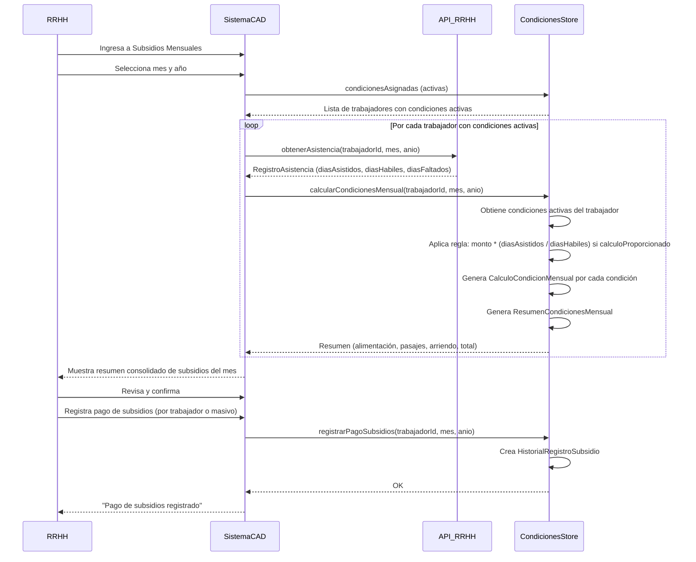
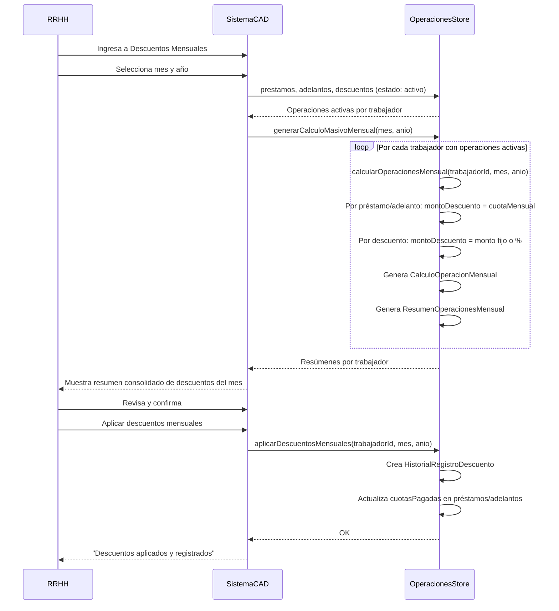
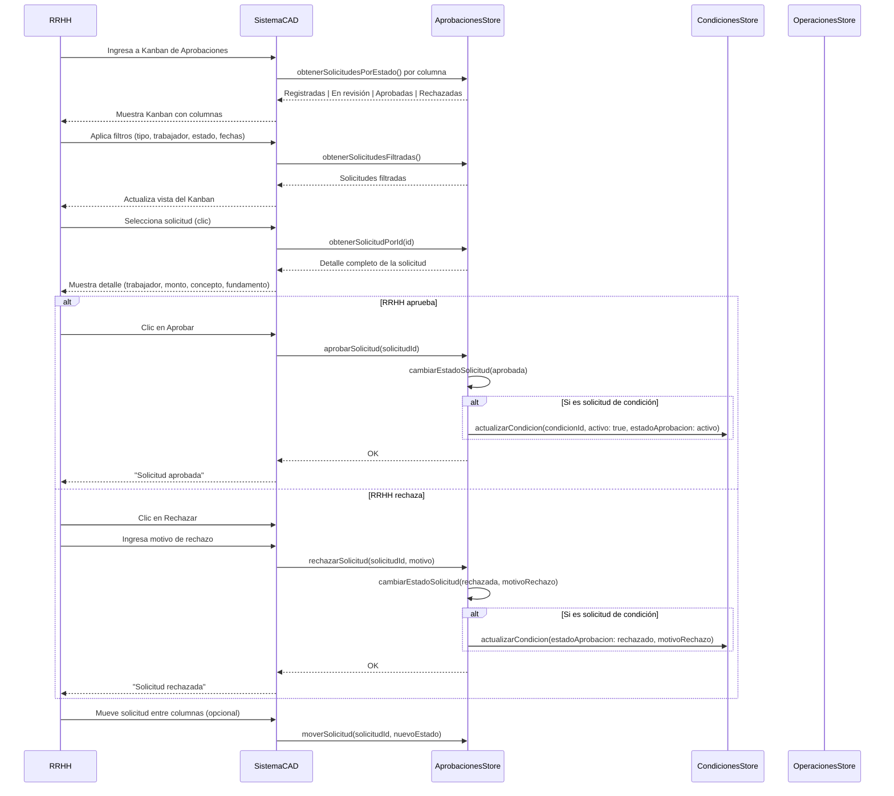
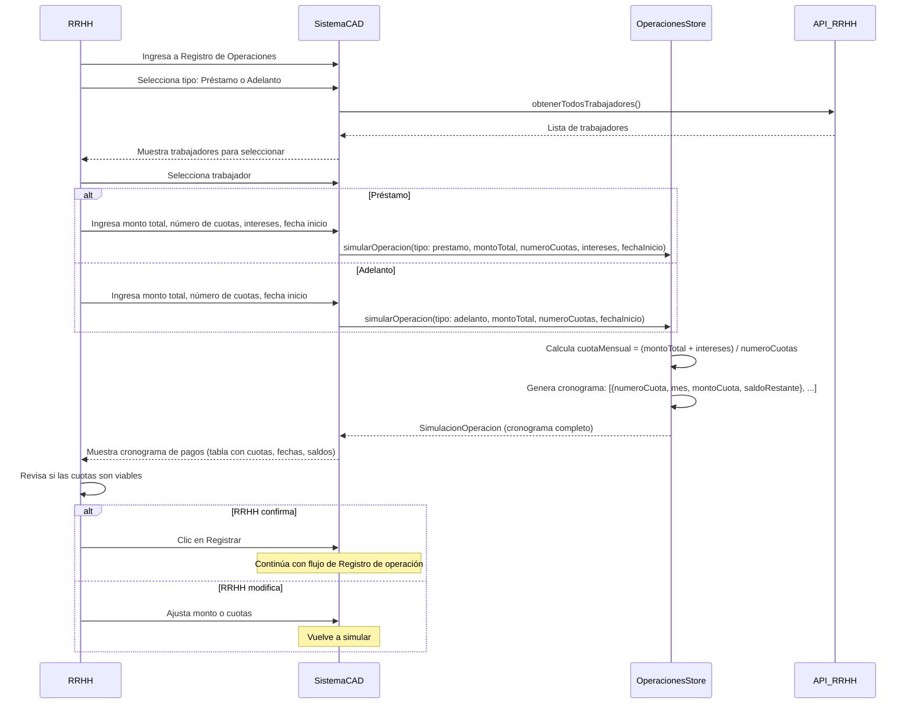

# Diagramas de Secuencia - MS. Condiciones, Anticipos y Descuentos

Documento con los flujos principales del sistema en formato Mermaid (compatible con GitHub).

---

## 1. Asignar condición a trabajador

RRHH asigna una condición (alimentación, movilidad, vivienda) a un trabajador. La condición queda pendiente de aprobación hasta que RRHH la revise en el Kanban.

---

## 2. Registrar préstamo, adelanto o descuento

RRHH registra una operación (préstamo, adelanto o descuento) para un trabajador. La operación inicia en estado pendiente_aprobacion.

---

## 3. Calcular subsidios mensuales

RRHH genera el cálculo mensual de subsidios (alimentación, pasajes, arriendo) usando asistencias del mes desde API RRHH.

---

## 4. Calcular y aplicar descuentos mensuales

RRHH genera el cálculo mensual de descuentos (préstamos, adelantos, descuentos) para aplicar a planillas.

---

## 5. Revisar y aprobar solicitudes en Kanban

RRHH revisa solicitudes pendientes (condiciones, préstamos, adelantos, descuentos) y las aprueba o rechaza.

---

## 6. Simular operación antes de registrar

RRHH simula un préstamo o adelanto para ver el cronograma de cuotas antes de registrar.

