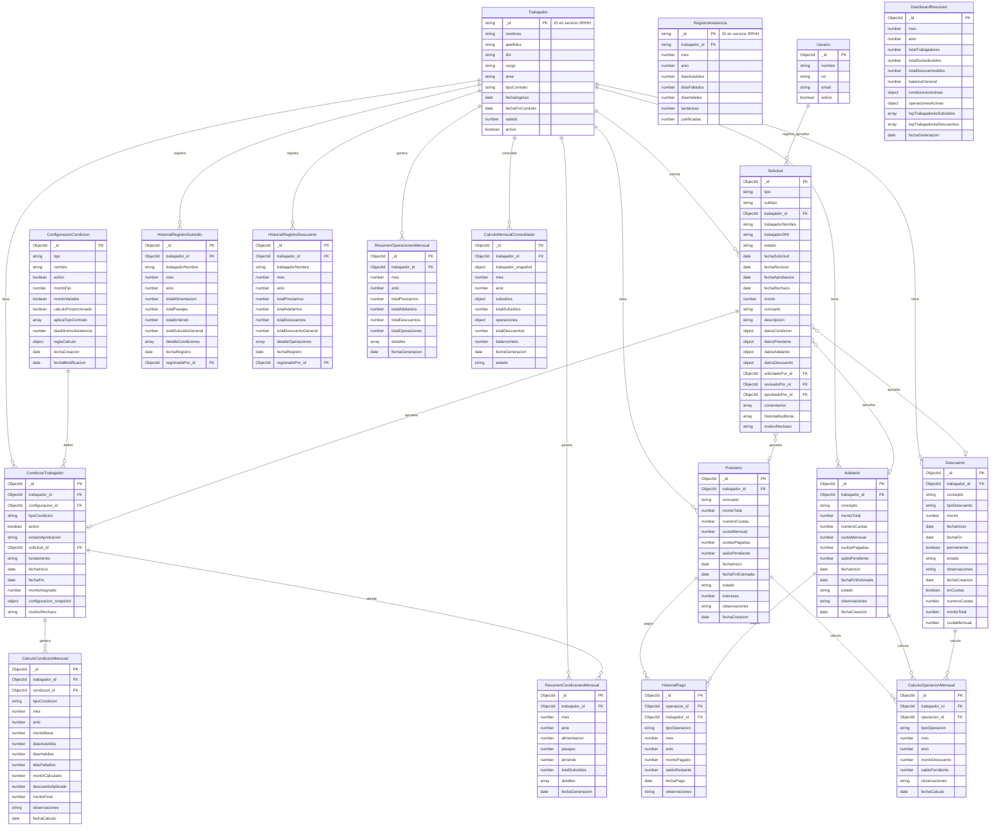

# Modelo Entidad-Relación - MS. Condiciones, Anticipos y Descuentos

**Base de datos:** MongoDB  
**Proyecto:** CAD (Condiciones, Anticipos y Descuentos)

---

## Entidades externas (servicios de referencia)

Las entidades **Trabajador** y **RegistroAsistencia** provienen de otros microservicios (RRHH). CAD solo almacena referencias por `trabajador_id`.

---

## Diagrama ER (Mermaid erDiagram)



---

## Colecciones MongoDB

### Externas (referenciadas)

| Entidad | Servicio origen | Referencia en CAD |
|---------|-----------------|-------------------|
| **Trabajador** | RRHH | `trabajador_id` (string) |
| **RegistroAsistencia** | RRHH / Asistencia | Consulta por API, no se persiste |

### Colecciones CAD

| Colección | Descripción |
|-----------|-------------|
| **usuarios** | Usuarios RRHH del sistema CAD |
| **configuraciones_condicion** | Plantillas de condiciones (alimentación, pasajes, arriendo) |
| **condiciones_trabajador** | Condiciones asignadas a trabajadores |
| **solicitudes** | Solicitudes de aprobación (condiciones y operaciones) |
| **prestamos** | Préstamos de empleados |
| **adelantos** | Adelantos de sueldo |
| **descuentos** | Descuentos diversos |
| **calculos_condicion_mensual** | Detalle de cálculo de subsidios por condición |
| **resumenes_condiciones_mensual** | Resumen mensual de subsidios por trabajador |
| **historial_registros_subsidios** | Registro de pago de subsidios |
| **historial_pagos** | Pagos aplicados a préstamos/adelantos |
| **calculos_operacion_mensual** | Detalle de cálculo de descuentos por operación |
| **resumenes_operaciones_mensual** | Resumen mensual de descuentos por trabajador |
| **historial_registros_descuentos** | Registro de aplicación de descuentos |
| **calculos_mensuales_consolidados** | Balance neto por trabajador/mes |
| **dashboard_resumenes** | Resumen agregado para dashboard |

---

## Detalle de entidades (atributos, PK, FK)

### ConfiguracionCondicion

| Campo | Tipo | Requerido | Descripción |
|-------|------|-----------|-------------|
| _id | ObjectId | Sí | PK |
| tipo | string | Sí | alimentacion, pasajes, arriendo |
| nombre | string | Sí | |
| activo | boolean | Sí | |
| montoFijo | number | No | |
| montoVariable | boolean | No | |
| calculoProporcionado | boolean | Sí | |
| aplicaTipoContrato | array | Sí | ['planilla','cas'] |
| diasMinimoAsistencia | number | No | |
| reglaCalculo | object | Sí | {tipo, formula, penalizaPorFalta, ...} |
| fechaCreacion | date | Sí | |
| fechaModificacion | date | Sí | |

### CondicionTrabajador

| Campo | Tipo | Requerido | Descripción |
|-------|------|-----------|-------------|
| _id | ObjectId | Sí | PK |
| trabajador_id | string | Sí | FK Trabajador (externo) |
| configuracion_id | ObjectId | Sí | FK ConfiguracionCondicion |
| tipoCondicion | string | Sí | alimentacion, pasajes, arriendo |
| activo | boolean | Sí | |
| estadoAprobacion | string | Sí | pendiente_aprobacion, activo, rechazado |
| solicitud_id | ObjectId | No | FK Solicitud |
| fundamento | string | Sí | |
| fechaInicio | date | Sí | |
| fechaFin | date | No | |
| montoAsignado | number | Sí | |
| configuracion_snapshot | object | No | Copia para histórico |
| motivoRechazo | string | No | |

### Solicitud

| Campo | Tipo | Requerido | Descripción |
|-------|------|-----------|-------------|
| _id | ObjectId | Sí | PK |
| tipo | string | Sí | condicion, prestamo, adelanto, descuento |
| subtipo | string | No | alimentacion, pasajes, arriendo |
| trabajador_id | string | Sí | FK Trabajador (externo) |
| trabajadorNombre | string | No | Desnormalizado |
| trabajadorDNI | string | No | Desnormalizado |
| estado | string | Sí | registrada, en_revision, aprobada, rechazada |
| fechaSolicitud | date | Sí | |
| fechaRevision | date | No | |
| fechaAprobacion | date | No | |
| fechaRechazo | date | No | |
| monto | number | Sí | |
| concepto | string | Sí | |
| descripcion | string | No | |
| datosCondicion | object | No | |
| datosPrestamo | object | No | |
| datosAdelanto | object | No | |
| datosDescuento | object | No | |
| solicitadoPor_id | ObjectId | Sí | FK Usuario |
| revisadoPor_id | ObjectId | No | FK Usuario |
| aprobadoPor_id | ObjectId | No | FK Usuario |
| comentarios | array | Sí | Subdocumentos |
| historialAuditoria | array | Sí | Subdocumentos |
| motivoRechazo | string | No | |

### Prestamo

| Campo | Tipo | Requerido | Descripción |
|-------|------|-----------|-------------|
| _id | ObjectId | Sí | PK |
| trabajador_id | string | Sí | FK Trabajador (externo) |
| concepto | string | Sí | |
| montoTotal | number | Sí | |
| numeroCuotas | number | Sí | |
| cuotaMensual | number | Sí | |
| cuotasPagadas | number | Sí | |
| saldoPendiente | number | Sí | |
| fechaInicio | date | Sí | |
| fechaFinEstimada | date | Sí | |
| estado | string | Sí | pendiente_aprobacion, activo, rechazado, finalizado |
| intereses | number | Sí | |
| observaciones | string | No | |
| fechaCreacion | date | Sí | |

### Adelanto

| Campo | Tipo | Requerido | Descripción |
|-------|------|-----------|-------------|
| _id | ObjectId | Sí | PK |
| trabajador_id | string | Sí | FK Trabajador (externo) |
| concepto | string | Sí | |
| montoTotal | number | Sí | |
| numeroCuotas | number | Sí | |
| cuotaMensual | number | Sí | |
| cuotasPagadas | number | Sí | |
| saldoPendiente | number | Sí | |
| fechaInicio | date | Sí | |
| fechaFinEstimada | date | Sí | |
| estado | string | Sí | pendiente_aprobacion, activo, rechazado, finalizado |
| observaciones | string | No | |
| fechaCreacion | date | Sí | |

### Descuento

| Campo | Tipo | Requerido | Descripción |
|-------|------|-----------|-------------|
| _id | ObjectId | Sí | PK |
| trabajador_id | string | Sí | FK Trabajador (externo) |
| concepto | string | Sí | |
| tipoDescuento | string | Sí | fijo, porcentual |
| monto | number | Sí | |
| fechaInicio | date | Sí | |
| fechaFin | date | No | |
| permanente | boolean | Sí | |
| estado | string | Sí | pendiente_aprobacion, activo, rechazado, finalizado |
| observaciones | string | No | |
| fechaCreacion | date | Sí | |
| enCuotas | boolean | No | |
| numeroCuotas | number | No | |
| montoTotal | number | No | |
| cuotaMensual | number | No | |

### ResumenCondicionesMensual

| Campo | Tipo | Requerido | Descripción |
|-------|------|-----------|-------------|
| _id | ObjectId | Sí | PK |
| trabajador_id | string | Sí | FK Trabajador |
| mes | number | Sí | 1-12 |
| anio | number | Sí | |
| alimentacion | number | Sí | |
| pasajes | number | Sí | |
| arriendo | number | Sí | |
| totalSubsidios | number | Sí | |
| detalles | array | Sí | [CalculoCondicionMensual] |
| fechaGeneracion | date | Sí | |

### ResumenOperacionesMensual

| Campo | Tipo | Requerido | Descripción |
|-------|------|-----------|-------------|
| _id | ObjectId | Sí | PK |
| trabajador_id | string | Sí | FK Trabajador |
| mes | number | Sí | |
| anio | number | Sí | |
| totalPrestamos | number | Sí | |
| totalAdelantos | number | Sí | |
| totalDescuentos | number | Sí | |
| totalOperaciones | number | Sí | |
| detalles | array | Sí | [CalculoOperacionMensual] |
| fechaGeneracion | date | Sí | |

### CalculoMensualConsolidado

| Campo | Tipo | Requerido | Descripción |
|-------|------|-----------|-------------|
| _id | ObjectId | Sí | PK |
| trabajador_id | string | Sí | FK Trabajador |
| trabajador_snapshot | object | No | Copia para reporte |
| mes | number | Sí | |
| anio | number | Sí | |
| subsidios | object | Sí | ResumenCondicionesMensual |
| totalSubsidios | number | Sí | |
| operaciones | object | Sí | ResumenOperacionesMensual |
| totalDescuentos | number | Sí | |
| balanceNeto | number | Sí | totalSubsidios - totalDescuentos |
| fechaGeneracion | date | Sí | |
| estado | string | Sí | generado, procesado, aplicado |

### DashboardResumen

| Campo | Tipo | Requerido | Descripción |
|-------|------|-----------|-------------|
| _id | ObjectId | Sí | PK |
| mes | number | Sí | |
| anio | number | Sí | |
| totalTrabajadores | number | Sí | |
| totalSubsidiosMes | number | Sí | |
| totalDescuentosMes | number | Sí | |
| balanceGeneral | number | Sí | |
| condicionesActivas | object | Sí | {alimentacion, pasajes, arriendo} |
| operacionesActivas | object | Sí | {prestamos, adelantos, descuentos} |
| topTrabajadoresSubsidios | array | Sí | |
| topTrabajadoresDescuentos | array | Sí | |
| fechaGeneracion | date | Sí | |

---

## Referencias en MongoDB

```
CondicionTrabajador.trabajador_id     → Trabajador._id (externo)
CondicionTrabajador.configuracion_id  → ConfiguracionCondicion._id
CondicionTrabajador.solicitud_id      → Solicitud._id

Solicitud.trabajador_id               → Trabajador._id (externo)
Solicitud.solicitadoPor_id            → Usuario._id
Solicitud.revisadoPor_id              → Usuario._id
Solicitud.aprobadoPor_id              → Usuario._id

Prestamo.trabajador_id                → Trabajador._id (externo)
Adelanto.trabajador_id                → Trabajador._id (externo)
Descuento.trabajador_id               → Trabajador._id (externo)

HistorialPago.operacion_id            → Prestamo._id | Adelanto._id
HistorialPago.trabajador_id           → Trabajador._id (externo)

CalculoCondicionMensual.condicion_id  → CondicionTrabajador._id
CalculoOperacionMensual.operacion_id  → Prestamo._id | Adelanto._id | Descuento._id
```

---

## Índices sugeridos

```javascript
// configuraciones_condicion
db.configuraciones_condicion.createIndex({ tipo: 1 })
db.configuraciones_condicion.createIndex({ activo: 1 })

// condiciones_trabajador
db.condiciones_trabajador.createIndex({ trabajador_id: 1 })
db.condiciones_trabajador.createIndex({ trabajador_id: 1, activo: 1 })
db.condiciones_trabajador.createIndex({ estadoAprobacion: 1 })
db.condiciones_trabajador.createIndex({ configuracion_id: 1 })

// solicitudes
db.solicitudes.createIndex({ estado: 1 })
db.solicitudes.createIndex({ trabajador_id: 1 })
db.solicitudes.createIndex({ tipo: 1, estado: 1 })
db.solicitudes.createIndex({ fechaSolicitud: -1 })

// prestamos, adelantos, descuentos
db.prestamos.createIndex({ trabajador_id: 1 })
db.prestamos.createIndex({ trabajador_id: 1, estado: 1 })
db.adelantos.createIndex({ trabajador_id: 1 })
db.adelantos.createIndex({ trabajador_id: 1, estado: 1 })
db.descuentos.createIndex({ trabajador_id: 1 })
db.descuentos.createIndex({ trabajador_id: 1, estado: 1 })

// resumenes (consultas por mes/año)
db.resumenes_condiciones_mensual.createIndex({ trabajador_id: 1, mes: 1, anio: 1 }, { unique: true })
db.resumenes_operaciones_mensual.createIndex({ trabajador_id: 1, mes: 1, anio: 1 }, { unique: true })
db.calculos_mensuales_consolidados.createIndex({ trabajador_id: 1, mes: 1, anio: 1 })
db.dashboard_resumenes.createIndex({ mes: 1, anio: 1 }, { unique: true })

// historiales
db.historial_registros_subsidios.createIndex({ trabajador_id: 1, mes: 1, anio: 1 })
db.historial_registros_descuentos.createIndex({ trabajador_id: 1, mes: 1, anio: 1 })
db.historial_pagos.createIndex({ operacion_id: 1 })
db.historial_pagos.createIndex({ trabajador_id: 1, mes: 1, anio: 1 })
```

---

## Notas para normalización

1. **Trabajador y RegistroAsistencia** son externos; CAD solo guarda `trabajador_id`.
2. **Subdocumentos embebidos**: `comentarios`, `historialAuditoria` en Solicitud; `detalles` en Resúmenes; `detalleCondiciones`, `detalleOperaciones` en Historiales.
3. **Desnormalización intencional**: `trabajadorNombre`, `trabajadorDNI` en Solicitud; `trabajador_snapshot` en CalculoMensualConsolidado para reportes históricos.
4. **Operaciones polimórficas**: HistorialPago y CalculoOperacionMensual referencian préstamo, adelanto o descuento por `operacion_id`; el campo `tipoOperacion` indica cuál es.
